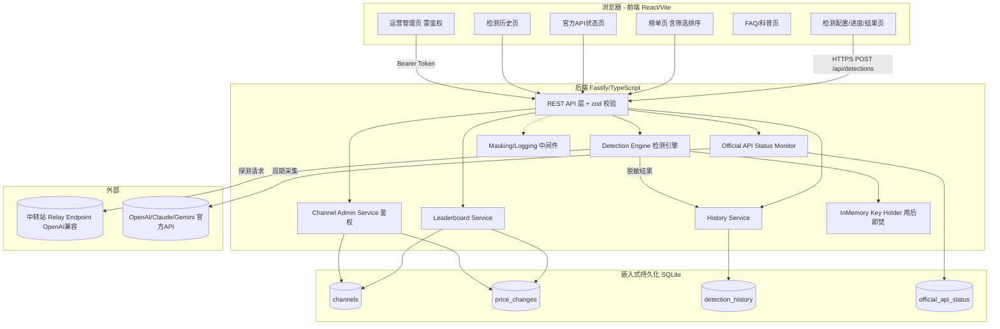
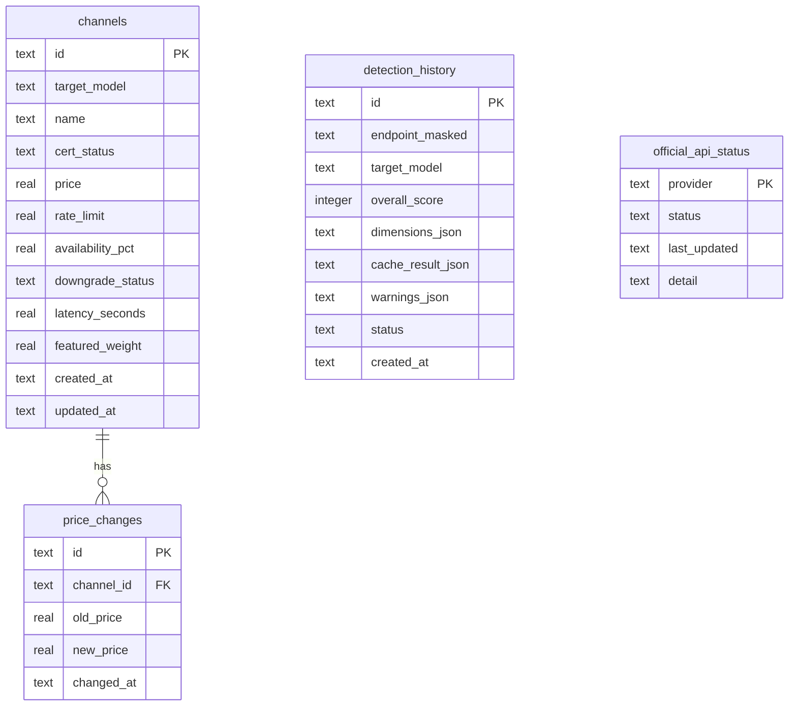

# Design Document

## Overview

tinyowl（猫头鹰评测）是一个面向 API 中转站（model-relay）的评测与验证平台，采用前后端分离的现代 Web 架构，可在本地一键启动。系统包含三大能力域：

1. **检测引擎（Detection Engine）**：对用户提供的 OpenAI 兼容中转站接口执行多轮、六维度探测，输出 0–100 的可信度评分与维度明细。方法学参考开源项目 [add-matong/llm-api-model-verifier](https://github.com/add-matong/llm-api-model-verifier) 与论文《Auditing Black-Box LLM APIs with a Rank-Based Uniformity Test》中的「基于秩的均匀性检验」思路。
2. **数据与展示域**：按模型分类的中转站榜单、官方 API 状态监控、检测历史、FAQ/科普内容。
3. **运营管理域**：渠道（Channel）的增删改查、价格变更历史，受身份鉴权保护。

核心约束：

- **API Key 隐私优先**：HTTPS 传输、仅在内存中存活、任务结束即焚、日志掩码（仅保留首尾各 4 字符）、历史仅存脱敏结果。
- **全环境持久化**：开发、测试、生产环境一律使用嵌入式 SQLite 文件存储，不依赖任何外部服务（REQ-12.4）。
- **中文界面**：全部用户可见文案为中文（REQ-12.2）。

### 技术栈选型与理由

经过权衡，选择 **TypeScript 单语言全栈 + 嵌入式 SQLite**：

| 层 | 选型 | 理由 |
| --- | --- | --- |
| 前端 | React 18 + Vite + TypeScript | Vite 本地启动快、HMR 体验好；React 生态成熟，适合榜单/表格/进度等交互。 |
| UI 组件 | Ant Design（中文友好） | 内置中文 locale，表格、筛选、排序、表单校验开箱即用，契合中文界面与榜单需求。 |
| 后端 | Node.js + Fastify + TypeScript | 与前端同语言，**前后端共享类型定义**（检测结果、榜单 DTO），降低契约漂移；Fastify 内置 schema 校验与高性能。 |
| 持久化 | SQLite（`better-sqlite3`）+ Drizzle ORM | 纯嵌入式、零外部依赖，满足「所有环境（含 dev/test）均持久化」；`better-sqlite3` 同步 API 简单可靠；Drizzle 提供类型安全的 schema 与迁移。 |
| HTTP 客户端 | `undici` | Node 原生高性能客户端，支持流式响应与精细超时控制（用于单轮 60s 超时）。 |
| 属性测试 | `fast-check` + `vitest` | fast-check 是 TS 生态最成熟的 PBT 库；vitest 与 Vite 同源、运行快。 |

**为何单语言全栈而非 Python FastAPI**：检测引擎产出的复杂结构化结果（六维度明细、评分、缓存判定）需要在前后端之间频繁传递。TypeScript 全栈可在 `packages/shared` 中维护**唯一事实来源（single source of truth）**的类型与校验 schema（zod），前端直接复用，避免双语言下的 DTO 重复定义与漂移。本地运行也只需一套 Node 工具链。

### 仓库与运行

- Git 仓库：`https://github.com/lewellynf/tinyowl.git`
- Monorepo（pnpm workspaces）：`packages/frontend`、`packages/backend`、`packages/shared`。
- 本地启动：`pnpm install` → `pnpm db:migrate` → `pnpm dev`（并行启动前端 5173、后端 3000）。

## Architecture

### 系统架构图



### 请求/数据流要点

- **检测流**：前端将 `{baseUrl, apiKey, targetModel, cacheDetection}` 经 HTTPS 提交 → 后端将 `apiKey` 仅放入内存 KeyHolder（绑定 taskId）→ 检测引擎执行多轮探测 → 计算评分 → 脱敏后写入历史 → **在 finally 中销毁 KeyHolder 中的密钥** → 返回结果（含「密钥已删除」确认）。
- **日志流**：所有日志经 Masking 中间件，任何匹配密钥模式的字符串被替换为 `首4****尾4`。
- **榜单流**：BoardSvc 读取 channels 与 price_changes，计算近 7 天价格变化百分比，应用筛选/排序后返回。
- **状态流**：StatusSvc 由定时调度（`node-cron`/`setInterval`）周期探测官方 API，写入 `official_api_status`；前端读取最新快照。

### 任务执行模型

检测任务为**同步长连接 + 进度流**：采用后端启动任务后通过 SSE（Server-Sent Events）`GET /api/detections/:taskId/stream` 推送进度（已完成轮次/当前维度），最终结果通过同一通道或轮询 `GET /api/detections/:taskId` 获取。任务状态机：`PENDING → RUNNING → (COMPLETED | AUTH_FAILED | ERROR)`。

## Components and Interfaces

### 前端组件

| 组件 | 职责 | 关键校验/交互 |
| --- | --- | --- |
| `DetectionForm` | 输入 baseUrl / apiKey / targetModel，缓存模式开关，隐私提示 | 空值校验（REQ-1.2/1.3/1.4）、URL 格式校验（REQ-1.5）、缓存开关提示（REQ-1.7）、隐私文案（REQ-1.8） |
| `DetectionProgress` | 通过 SSE 展示进度与已完成轮次 | 显示当前维度与轮次计数（REQ-3.11） |
| `DetectionResult` | 展示评分、六维度明细、警示与免责声明、密钥删除确认 | 身份替换/降智警示（REQ-5.5/5.6）、警示失败降级（REQ-5.7）、密钥删除确认（REQ-2.6） |
| `Leaderboard` | 按模型切换的榜单表格，筛选与排序 | 列展示（REQ-7.2）、认证筛选（REQ-8.1/8.2）、精选/价格排序（REQ-8.3/8.4/8.5）、空态（REQ-7.5） |
| `OfficialStatusPanel` | 官方 API 状态卡片 | 三态展示与更新时间（REQ-9.3/9.4/9.5） |
| `HistoryList` / `HistoryDetail` | 历史列表（时间倒序）与明细 | REQ-6.3/6.4 |
| `FaqPage` | 科普内容 | 全中文（REQ-10） |
| `AdminChannelPanel` | 渠道 CRUD（登录后） | 必填校验、鉴权（REQ-11） |

### 后端服务接口

```typescript
// packages/shared/src/types.ts —— 前后端共享

type Dimension =
  | 'protocol_consistency'   // 返回协议一致性
  | 'response_structure'     // 响应结构
  | 'knowledge_qa'           // 知识问答结果
  | 'identity_consistency'   // 身份一致性
  | 'reasoning_trace'        // 思维链痕迹
  | 'signature_fingerprint'; // 签名指纹

type RoundStatus = 'ok' | 'timeout';
type TaskStatus = 'PENDING' | 'RUNNING' | 'COMPLETED' | 'AUTH_FAILED' | 'ERROR';
type CertStatus = 'enterprise' | 'personal' | 'none'; // 企业/个人实名/未认证

interface DimensionResult {
  dimension: Dimension;
  verdict: 'pass' | 'suspect' | 'fail' | 'inconclusive';
  score: number;        // 0..100 维度子分
  explanation: string;  // 中文说明
}

interface DetectionResult {
  taskId: string;
  status: TaskStatus;
  targetModel: string;
  endpointMasked: string;       // 脱敏后的中转站标识
  overallScore: number;         // 0..100
  dimensions: DimensionResult[];
  cacheDetection?: { enabled: boolean; cacheHitSuspected: boolean; explanation: string };
  warnings: ('identity_swap' | 'downgrade')[];
  rounds: { index: number; status: RoundStatus }[];
  keyWiped: boolean;            // 密钥已删除确认
  createdAt: string;            // ISO8601
}
```

#### Detection Engine 接口

```typescript
interface ProbeContext {
  baseUrl: string;
  apiKeyRef: KeyRef;     // 仅引用内存密钥，不直接持有明文
  targetModel: string;
  cacheDetection: boolean;
  onProgress: (p: { round: number; dimension: Dimension }) => void;
}

interface DetectionEngine {
  run(ctx: ProbeContext): Promise<DetectionResult>;
}

// 每个维度探测器实现统一接口，便于组合与测试
interface DimensionProbe {
  dimension: Dimension;
  evaluate(samples: RelaySample[], target: ModelProfile): DimensionResult; // 纯函数：可属性测试
}
```

**纯函数边界（便于属性测试）**：网络 I/O（采样）与判定逻辑分离。`DimensionProbe.evaluate`、评分聚合 `aggregateScore`、价格变化计算 `priceDeltaPct`、榜单筛选排序 `applyFilterSort`、掩码 `maskKey`、脱敏 `desensitize` 均为**纯函数**，是属性测试的主要目标。

### REST API 表面

| 方法 | 路径 | 说明 | 鉴权 |
| --- | --- | --- | --- |
| `POST` | `/api/detections` | 创建检测任务，body：`{baseUrl, apiKey, targetModel, cacheDetection}`，返回 `{taskId}` | 否 |
| `GET` | `/api/detections/:taskId` | 查询任务结果（脱敏） | 否 |
| `GET` | `/api/detections/:taskId/stream` | SSE 进度流 | 否 |
| `GET` | `/api/history` | 历史列表，时间倒序，支持分页 | 否 |
| `GET` | `/api/history/:id` | 历史明细 | 否 |
| `GET` | `/api/leaderboard?model=&cert=&sort=` | 榜单查询（筛选/排序） | 否 |
| `GET` | `/api/official-status` | 官方 API 状态快照 | 否 |
| `POST` | `/api/admin/login` | 运营者登录，返回 Bearer Token | 否 |
| `POST` | `/api/admin/channels` | 创建渠道 | 是 |
| `PUT` | `/api/admin/channels/:id` | 更新渠道（含价格变更记录） | 是 |
| `DELETE` | `/api/admin/channels/:id` | 删除渠道 | 是 |

错误返回统一结构：`{ error: { code: string, message: string } }`（中文 message）。未授权返回 `401`（REQ-11.5）；脱敏失败返回 `500 DESENSITIZE_FAILED`（REQ-2.5）。

## Data Models

### 共享枚举与值

- `Dimension`：六维度（见上）。
- `CertStatus`：`enterprise` | `personal` | `none`，前端映射「企业认证/个人实名认证/未认证」。
- `OfficialStatusValue`：`normal` | `abnormal` | `unknown`，前端映射「正常/异常/未知」。

### SQLite 表结构（Drizzle schema 概念）



字段说明（关键）：

- `channels`：必填字段为 `name`、`cert_status`、`price`、`target_model`（REQ-11.2）；`featured_weight` 用于精选排序（REQ-8.5）；`availability_pct`、`latency_seconds`、`downgrade_status`、`rate_limit` 对应榜单列（REQ-7.2）。
- `price_changes`：每次价格更新插入一条，用于计算近 7 天价格变化百分比（REQ-11.3 / REQ-7.2）。
- `detection_history`：**仅存脱敏数据**，无 `api_key` 字段（REQ-2.4 / REQ-6.5）；维度明细以 JSON 文本存储（REQ-6.2）。
- `official_api_status`：`provider` ∈ {`openai`,`claude`,`gemini`}，`status` ∈ 三态（REQ-9.3）。

### 内存密钥模型（不落盘）

```typescript
// KeyHolder：进程内 Map<taskId, string>，任务结束 finally 中 delete + 覆写
class InMemoryKeyHolder {
  private store = new Map<string, string>();
  put(taskId: string, apiKey: string): KeyRef { /* ... */ }
  use<T>(ref: KeyRef, fn: (key: string) => T): T { /* ... */ }
  wipe(taskId: string): void { this.store.delete(taskId); } // REQ-2.2
}
```

### 近 7 天价格变化百分比计算

`priceDeltaPct(current, changesWithin7d)`：取 7 天窗口内**最早一条**变更的 `old_price` 作为基准 `base`，`delta = (current - base) / base * 100`。若窗口内无变更记录，返回 `0`。该函数为纯函数，便于属性测试。

## Detection Pipeline（检测流水线详细设计）

检测引擎是系统核心，遵循「采样（有 I/O）→ 判定（纯函数）→ 聚合（纯函数）」三段式。

### 探测轮次与超时

- 每个维度执行 N 轮探测（默认 `N=5`，身份/知识维度可固定题库 + 随机题库混合）。
- 单轮通过 `undici` 设置 60s `headersTimeout`/`bodyTimeout`：单轮超时仅标记该轮 `timeout` 并继续后续轮次（REQ-3.10）。
- 任一探测返回 `401/403`（鉴权失败）：**立即中止整个任务**，返回 `AUTH_FAILED`，不返回任何维度结果（REQ-3.9）。

### 六维度判定方法

1. **返回协议一致性（protocol_consistency）**：校验非流式响应 JSON 顶层字段（`id`、`object`、`choices`、`model`）与流式 SSE 分块格式（`data: {...}` / `[DONE]`、增量 `delta`）是否符合 OpenAI 兼容协议（REQ-3.3）。
2. **响应结构（response_structure）**：校验 `usage`（`prompt_tokens`/`completion_tokens`/`total_tokens` 为非负整数且 total=prompt+completion）、`finish_reason` ∈ 合法集合、`choices[].message.role`='assistant' 等结构合法性（REQ-3.4）。
3. **知识问答结果（knowledge_qa）**：发送一组已知确定答案的探测题，比对返回内容是否命中预期；过低命中率提示能力低于声称模型（REQ-3.5），是降智判定输入之一。
4. **身份一致性（identity_consistency）**：通过身份探测题（如「你是哪个模型/版本」）解析自述身份并与 `targetModel` 比对；不一致 → `identity_swap` 警示（REQ-3.6 / REQ-5.5）。
5. **思维链痕迹（reasoning_trace）**：检测响应是否包含与目标模型推理特征匹配的思维链/推理标记（如 reasoning 字段、特定结构）（REQ-3.7）。
6. **签名指纹（signature_fingerprint）**：采集多次采样的统计指纹（token 分布、长度分布、固定 prompt 下输出的秩统计），应用**基于秩的均匀性检验**（参考 Rank-Based Uniformity Test）与目标模型基线 `ModelProfile` 比对；显著偏离 → 疑似替换/降智（REQ-3.8 / REQ-5.6）。

### 缓存检测模式（可选，约 +30s）

开启时（REQ-4.1/4.2）：对同一与近似 prompt 发送重复请求，比较响应是否字节级/近似一致且延迟异常偏低，判定 `cacheHitSuspected`；关闭时完全跳过（REQ-4.3）。

### 评分聚合

`aggregateScore(dimensions)`：对六维度子分加权求和并裁剪到 `[0,100]`。鉴权失败任务不进入聚合。降智/身份替换警示由维度 verdict 派生：`identity_consistency.verdict==='fail'` → `identity_swap`；`knowledge_qa` 或 `signature_fingerprint` verdict `suspect|fail` → `downgrade`。
