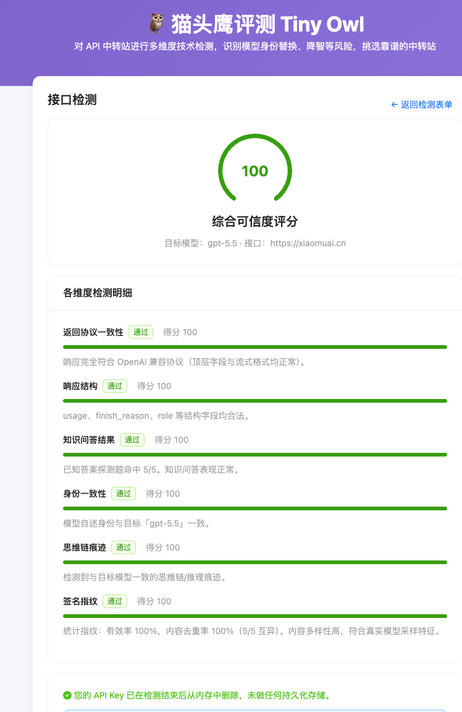
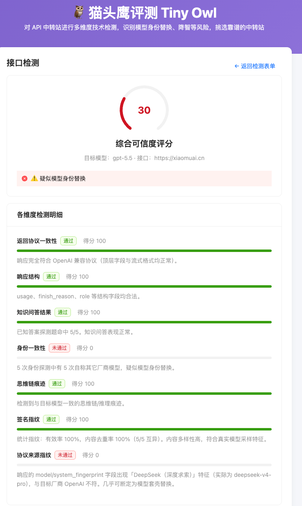

# 🦉 tinyowl 猫头鹰评测

> 面向 API「中转站」（model-relay）的评测与验证平台 · [tinyowl.cn](https://tinyowl.cn)

tinyowl 对用户提供的 OpenAI 兼容中转站接口进行多轮、七维度技术探测，输出 0–100 的可信度评分与维度明细，帮助用户识别「模型身份替换」「降智」「协议不一致」等风险；同时维护按模型分类的中转站榜单、官方 API 状态监控、检测历史与科普内容。

> ⚠️ 本检测为低成本技术性验证，非法律审计，不保证 100% 准确。

## 实测效果

同样声称提供 `gpt-5.5`，两个中转站的检测结果截然不同：左侧是货真价实的官方模型（综合 100 分，七维度全部通过）；右侧实为 `deepseek-v4` 假冒（综合 30 分，**协议来源指纹**维度识破高仿替换，触发「疑似模型身份替换」告警）。

<table>
<tr>
<td width="50%" align="center"><b>✅ 真实 gpt-5.5（评分 100）</b></td>
<td width="50%" align="center"><b>⚠️ deepseek-v4 假冒（评分 30）</b></td>
</tr>
<tr>
<td></td>
<td></td>
</tr>
</table>

## 功能概览

- **接口检测**：输入中转站地址、API Key、目标模型，发起多维度检测，实时进度（SSE）。
  - 七维度：返回协议一致性、响应结构、知识问答结果、身份一致性、思维链痕迹、签名指纹、协议来源指纹。
  - 可选缓存检测模式（约 +30s）。
- **API Key 隐私**：HTTPS 传输、仅内存存活、任务结束即焚、日志掩码（首尾各 4 字符）、历史仅存脱敏结果。
- **模型榜单**：按目标模型切换，展示认证状态、价格、近 7 天价格变化、限速、可用率、降智情况、延迟；支持认证筛选与精选/价格排序。
- **官方 API 状态**：周期监控 OpenAI / Claude / Gemini 三态（正常/异常/未知）。
- **检测历史**：时间倒序列表与明细（脱敏）。
- **FAQ 科普**：中转站概念、风险、检测原理与使用建议。
- **运营管理**：渠道增删改查（鉴权保护），价格变更自动记录。

## 技术栈

TypeScript 单语言全栈 + 嵌入式 SQLite（零外部依赖，所有环境均持久化）。

| 层 | 选型 |
| --- | --- |
| 前端 | React 18 + Vite + Ant Design（中文 locale） |
| 后端 | Node.js + Fastify + undici |
| 持久化 | SQLite（better-sqlite3）+ Drizzle ORM |
| 共享 | `packages/shared`：前后端共享类型与 zod 校验（唯一事实来源） |
| 测试 | vitest + fast-check（属性测试） |

Monorepo（pnpm workspaces）：`packages/frontend`、`packages/backend`、`packages/shared`。

## 本地运行

### 环境要求

- Node.js >= 20（开发使用 24）
- pnpm >= 10
- 首次安装需编译 better-sqlite3 原生模块（需本地 C++ 工具链：macOS 装 Xcode CLT，Linux 装 build-essential）。

### 启动步骤

```bash
# 1. 安装依赖
pnpm install

# 2. 若 better-sqlite3 原生模块未自动编译，手动编译一次
pnpm rebuild better-sqlite3

# 3. 初始化数据库 + 写入种子数据
pnpm db:migrate
pnpm db:seed

# 4. 并行启动前端（5173）与后端（3000）
pnpm dev
```

启动后访问：

- 前端：http://localhost:5173
- 后端 API：http://localhost:3000/api/health

前端通过 Vite 代理将 `/api` 转发至后端 3000 端口。

### 可用脚本

| 命令 | 说明 |
| --- | --- |
| `pnpm dev` | 并行启动前后端开发服务器 |
| `pnpm build` | 依次构建 shared、backend、frontend |
| `pnpm db:migrate` | 执行数据库迁移（建表，幂等） |
| `pnpm db:seed` | 写入示例渠道与官方状态数据 |
| `pnpm test` | 运行后端单元/属性测试 |
| `pnpm typecheck` | 全包类型检查 |

## 配置

后端通过环境变量配置（均有默认值，开发可不设置）：

| 变量 | 默认值 | 说明 |
| --- | --- | --- |
| `PORT` | `3000` | 后端端口 |
| `HOST` | `0.0.0.0` | 后端监听地址 |
| `DB_PATH` | `packages/data/tinyowl.sqlite` | SQLite 文件路径 |
| `ADMIN_USERNAME` | `admin` | 运营账号 |
| `ADMIN_PASSWORD` | `tinyowl` | 运营密码（生产务必修改） |
| `ADMIN_TOKEN_SECRET` | `tinyowl-dev-secret-change-me` | Token 签名密钥（生产务必修改） |
| `PROBE_ROUNDS` | `5` | 每维度探测轮次 |
| `ROUND_TIMEOUT_MS` | `60000` | 单轮超时（毫秒） |

参见 `.env.example`。

## 运营管理

访问前端「运营管理」页，使用上述账号登录后可对榜单渠道进行增删改查。更新价格时系统自动记录价格变更，用于计算近 7 天价格变化百分比。

## 检测引擎设计

引擎遵循「采样（I/O）→ 判定（纯函数）→ 聚合（纯函数）」三段式：

- `src/engine/sampler.ts`：undici 调用中转站，单轮 60s 超时仅标记不中断；401/403 立即中止任务；并提取响应协议元数据（id 前缀、usage 字段、结束原因等）。
- `src/engine/probes.ts`：七个维度判定均为纯函数，便于属性测试。
- `src/engine/score.ts`：加权聚合评分（inconclusive 维度剔除），来源冲突时硬封顶总分并派生身份替换/降智警示。
- `src/engine/keyHolder.ts`：进程内密钥持有，任务结束 `finally` 中销毁。

七维体系中，**协议来源指纹**（响应元数据厂商一致性）是最难伪造、权重最高的维度，可识破「行为层伪装到位但底层来源不符」的高仿替换。完整原理见 **[检测原理白皮书](docs/检测原理.md)**。

方法学参考论文《Auditing Black-Box LLM APIs with a Rank-Based Uniformity Test》《Are You Getting What You Pay For? Auditing Model Substitution in LLM APIs》等（详见白皮书引用文献）。

## 目录结构

```
tinyowl/
├── packages/
│   ├── shared/      # 前后端共享类型 + zod schema
│   ├── backend/     # Fastify API + 检测引擎 + SQLite
│   └── frontend/    # React + Vite + Ant Design
├── pnpm-workspace.yaml
└── package.json
```

## 许可

© 2026 tinyowl.cn
